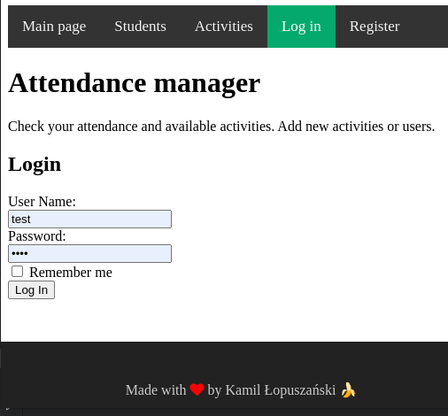

**Attendance manager** for managing activities and users that attend them. There are 2 roles for users: admin and student.
Admin can manage the users, and a student can only browse the activities, check in or out of them.

Login page



### Frontend
To run frontend, go to `frontend/attendance` and then follow the instructions in [README](./frontend/attendance/README.md). That is, 
```
cd frontend/attendance
npm install
npm start
```

### Technologies

Technologies that are used:
* Maven
* Spring Boot, Spring Data, Spring Security
* Angular 
* Apache Kafka

### Create a simple web application
Now you can create a web controller for a simple web application.

Execute:

```
cd backend
mvn clean spring-boot:run
```

## Integration with database
To integrate your application with PostgreSQL database, you have to supply 
configuration file to Spring framework and put it somewhere in `/src/main/resources` probably.

It doesn't have to be YAML, but I suggest this format and used it in follwing way (*application.yml*):
```yaml
#
# [ Database Configuration Section ]
#

spring:
  datasource:
    #platform: postgres
    url: jdbc:postgresql://localhost:5432/mydb
    username: postgres
    password: ***** ***
    driver-class-name: org.postgresql.Driver
    # Keep the connection alive if idle for a long time (needed in production)
    test-while-idle: true
    validation-query: SELECT 1
    # ===============================
    # = JPA / HIBERNATE
    # ===============================
    # Show or not log for each sql query
  jpa:
    hibernate:
      ddl-auto: create
      naming:
        implicit-strategy: org.hibernate.boot.model.naming.ImplicitNamingStrategyLegacyHbmImpl
        physical-strategy: org.springframework.boot.orm.jpa.hibernate.SpringPhysicalNamingStrategy
    show-sql: true
    properties:
      hibernate:
        dialect: org.hibernate.dialect.PostgreSQLDialect

hw.spring.jwt.secret: ########    
   
jwt:
  header: Authorization
  secret: mySecret
  expiration: 604800
  route:
    authentication:
      path: auth
      refresh: refresh

frontend:
  origin: localhost:4200

logging:
  level:
    org:
      springframework:
        security:
          web:
            FilterChainProxy: DEBUG
            access:
              ExceptionTranslationFilter: TRACE

message:
  topic:
    name: spring-hw

long:
  message:
    topic:
      name: Attendance manager Spring-HW
topic:
  name:
    check-in: check-in-topic
    check-out: check-out-topic
    activity-attendance: activity-attendance-topic
```
where `******` is my password. You also have to provide secret string for JSON Web Tokens (`######`).
